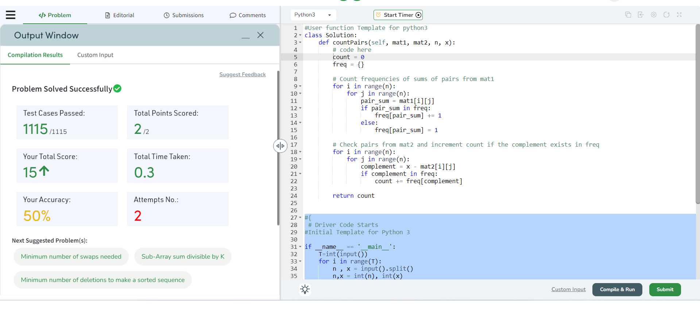

Given two sorted matrices mat1 and mat2 of size n x n of elements. Each matrix contains numbers arranged in strictly ascending order, with each row sorted from left to right, and the last element of a row being smaller than the first element of the next row. You're given a target value, x, your task is to find and count all pairs {a, b} such that a is from mat1 and b is from mat2 where sum of a and b is equal to x.

Example 1:

Input: 
n = 3, x = 21
mat1 = {{1, 5, 6},
        {8, 10, 11},
        {15, 16, 18}}
mat2 = {{2, 4, 7},
        {9, 10, 12},
        {13, 16, 20}}
OUTPUT: 4
Explanation: The pairs whose sum is found to be 21 are (1, 20), (5, 16), (8, 13), (11, 10).
Example 2:

Input:
n = 2, x = 10
mat1 = {{1, 2},
        {3, 4}}
mat2 = {{4, 5},
        {6, 7}}
Output: 2
Explanation: The pairs whose sum found to be 10 are (4, 6), (3, 7).
User Task:
Your task is to complete the function countPairs() which takes 4 arguments mat1, mat2, n, x, and returns the count of pairs whose sum equals to x. You don't need to take any input or print anything.

Expected Time Complexity: O(n2).
Expected Auxiliary Space: O(1).

Constraints:
1 ≤ mat1[i][j] , mat2[i][j] ≤ 105
1 ≤ n ≤ 100
1 ≤ x ≤ 105

