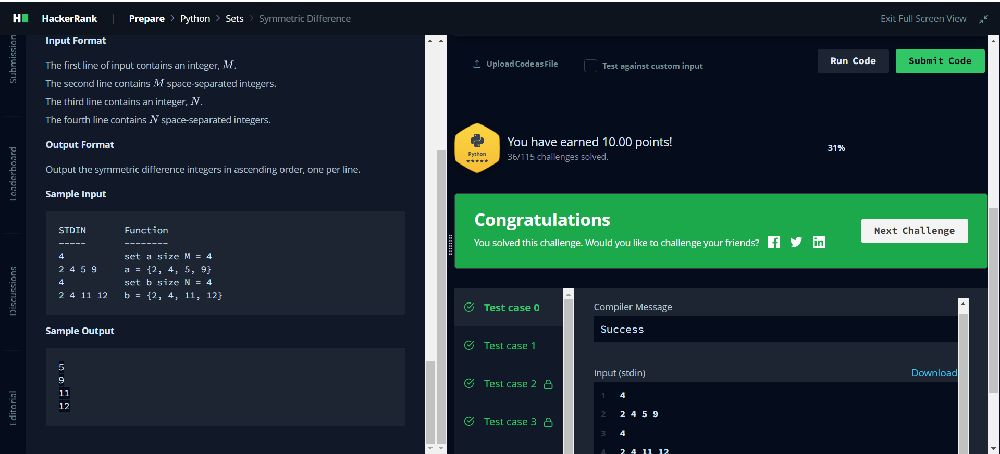

Objective
Today, we're learning about a new data type: sets.

Concept

If the inputs are given on one line separated by a character (the delimiter), use split() to get the separate values in the form of a list. The delimiter is space (ascii 32) by default. To specify that comma is the delimiter, use string.split(','). For this challenge, and in general on HackerRank, space will be the delimiter.

Usage:

>> a = raw_input()
5 4 3 2
>> lis = a.split()
>> print (lis)
['5', '4', '3', '2']
If the list values are all integer types, use the map() method to convert all the strings to integers.

>> newlis = list(map(int, lis))
>> print (newlis)
[5, 4, 3, 2]
Sets are an unordered collection of unique values. A single set contains values of any immutable data type.

CREATING SETS

>> myset = {1, 2} # Directly assigning values to a set
>> myset = set()  # Initializing a set
>> myset = set(['a', 'b']) # Creating a set from a list
>> myset
{'a', 'b'}

MODIFYING SETS

Using the add() function:

>> myset.add('c')
>> myset
{'a', 'c', 'b'}
>> myset.add('a') # As 'a' already exists in the set, nothing happens
>> myset.add((5, 4))
>> myset
{'a', 'c', 'b', (5, 4)}

Using the update() function:

>> myset.update([1, 2, 3, 4]) # update() only works for iterable objects
>> myset
{'a', 1, 'c', 'b', 4, 2, (5, 4), 3}
>> myset.update({1, 7, 8})
>> myset
{'a', 1, 'c', 'b', 4, 7, 8, 2, (5, 4), 3}
>> myset.update({1, 6}, [5, 13])
>> myset
{'a', 1, 'c', 'b', 4, 5, 6, 7, 8, 2, (5, 4), 13, 3}

REMOVING ITEMS

Both the discard() and remove() functions take a single value as an argument and removes that value from the set. If that value is not present, discard() does nothing, but remove() will raise a KeyError exception.

>> myset.discard(10)
>> myset
{'a', 1, 'c', 'b', 4, 5, 7, 8, 2, 12, (5, 4), 13, 11, 3}
>> myset.remove(13)
>> myset
{'a', 1, 'c', 'b', 4, 5, 7, 8, 2, 12, (5, 4), 11, 3}

COMMON SET OPERATIONS Using union(), intersection() and difference() functions.

>> a = {2, 4, 5, 9}
>> b = {2, 4, 11, 12}
>> a.union(b) # Values which exist in a or b
{2, 4, 5, 9, 11, 12}
>> a.intersection(b) # Values which exist in a and b
{2, 4}
>> a.difference(b) # Values which exist in a but not in b
{9, 5}

The union() and intersection() functions are symmetric methods:

>> a.union(b) == b.union(a)
True
>> a.intersection(b) == b.intersection(a)
True
>> a.difference(b) == b.difference(a)
False
These other built-in data structures in Python are also useful.

Task
Given  sets of integers,  and , print their symmetric difference in ascending order. The term symmetric difference indicates those values that exist in either  or  but do not exist in both.

Input Format

The first line of input contains an integer, .
The second line contains  space-separated integers.
The third line contains an integer, .
The fourth line contains  space-separated integers.

Output Format

Output the symmetric difference integers in ascending order, one per line.

Sample Input

STDIN       Function
-----       --------
4           set a size M = 4
2 4 5 9     a = {2, 4, 5, 9}
4           set b size N = 4
2 4 11 12   b = {2, 4, 11, 12}
Sample Output

5
9
11
12

