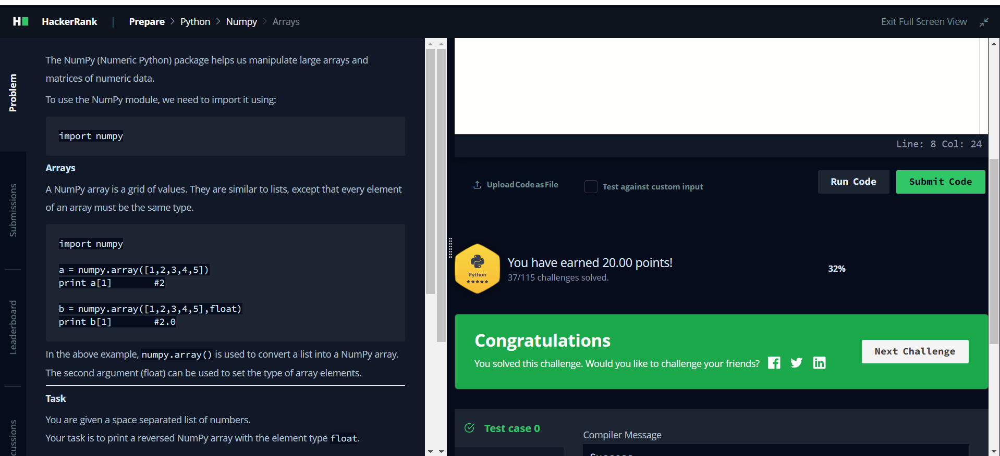

The NumPy (Numeric Python) package helps us manipulate large arrays and matrices of numeric data.

To use the NumPy module, we need to import it using:

import numpy
Arrays

A NumPy array is a grid of values. They are similar to lists, except that every element of an array must be the same type.

import numpy

a = numpy.array([1,2,3,4,5])
print a[1]          #2

b = numpy.array([1,2,3,4,5],float)
print b[1]          #2.0
In the above example, numpy.array() is used to convert a list into a NumPy array. The second argument (float) can be used to set the type of array elements.

Task

You are given a space separated list of numbers.
Your task is to print a reversed NumPy array with the element type float.

Input Format

A single line of input containing space separated numbers.

Output Format

Print the reverse NumPy array with type float.

Sample Input

1 2 3 4 -8 -10
Sample Output

[-10.  -8.   4.   3.   2.   1.]

